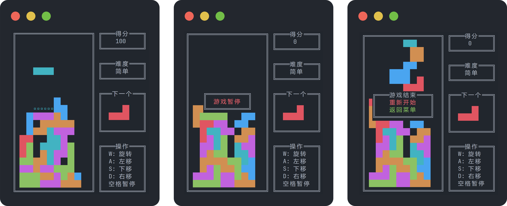

# Tetris
  

## 介绍
现代 C++ 实现的 Windows 和 Linux 终端俄罗斯方块，有丰富的 UI 界面。采用了面向对象的思想，将游戏主要分为四块：数据结构（`block` 和 `table`）、输入（`keyboard`）、输出（`display`）、游戏逻辑（`controller`），每一块都有各自的测试代码，容易 Debug 和修改。



## 如何使用

注意：由于 UI 中有中文，部分字体可能出现显示错位的情况，通过安装 **等宽字体** 并修改终端字体来解决。

操作：菜单界面 `W` 和 `S` 是上下，空格是确认。游戏界面 `W` 是旋转，`A` 和 `D` 是左右，`S` 是下降，空格是暂停。

### Windows 平台
请确保你的电脑安装了 `g++` 并且已经设置好了环境变量，运行 `make.bat` 即可完成编译，主目录下会出现 `main.exe` 程序。

如果你有额外的编译需求，可以自行修改。

> Windows 平台编译工具安装麻烦，所以采用了这种最简陋的方法。

### Linux 平台
请确保电脑安装了 `g++` 和 `make`。

```shell
# 构建程序
make main

# 运行程序
./main
```